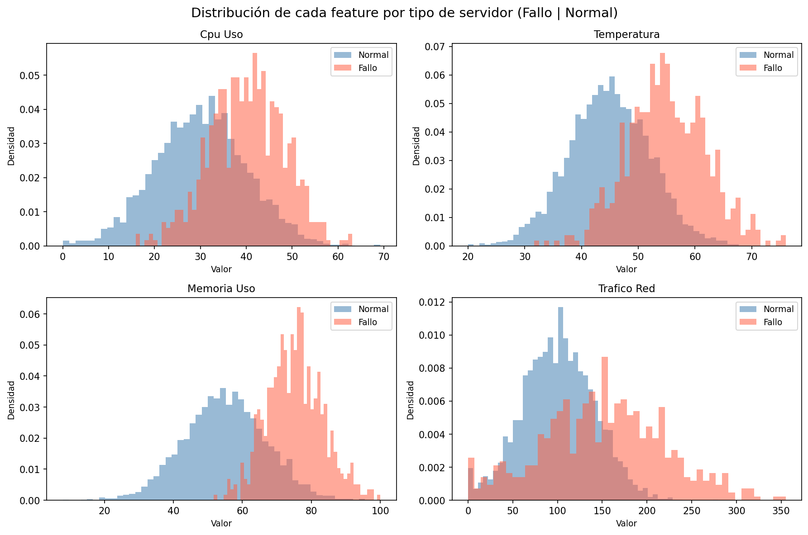
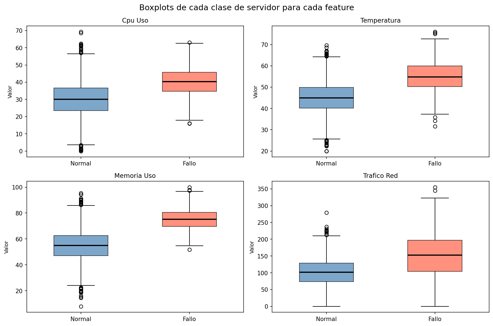
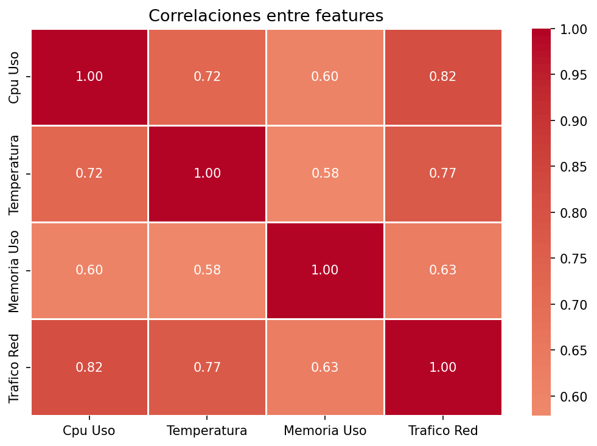
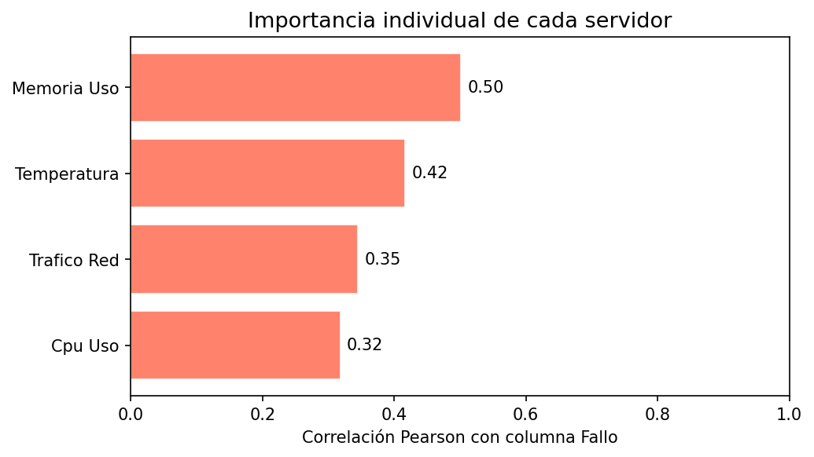
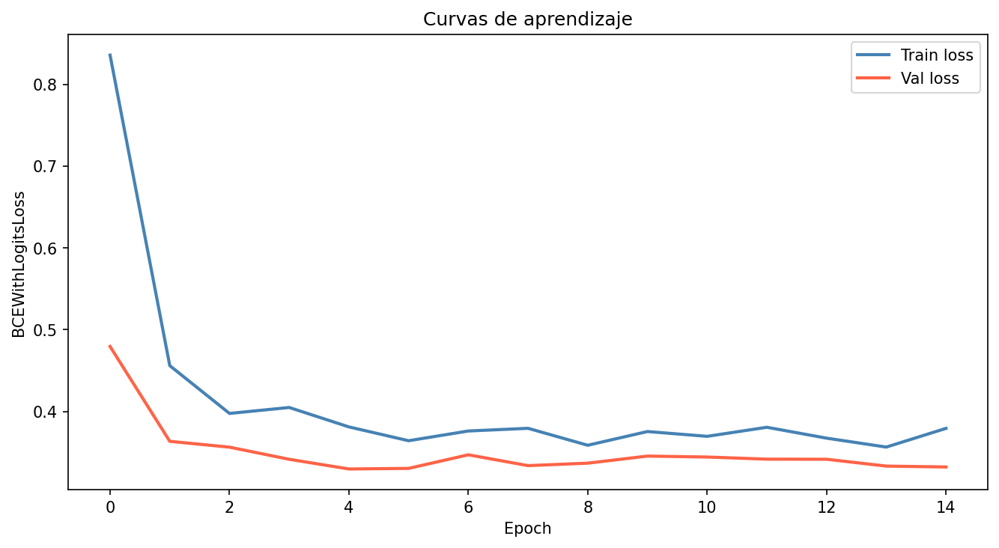
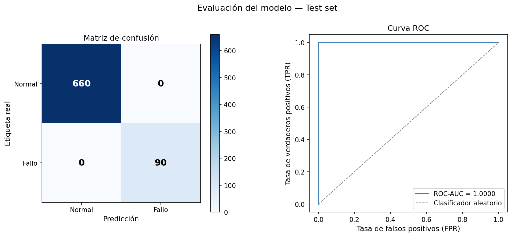

# Stream — Detección de Anomalías en Servidores

Red neuronal densa (MLP) en PyTorch para clasificar servidores de una empresa ficticia,
Stream, entre estado normal y estado de fallo. El proyecto incluye un generador de datos
sintéticos, análisis exploratorio, pipeline de preprocesamiento, entrenamiento con early stopping,
evaluación frente a un baseline y una función de inferencia sobre datos nuevos.

Las features monitorizadas son uso de CPU, temperatura, uso de memoria y tráfico de red.

---

## Descripción del problema

Cada servidor se describe mediante cuatro variables continuas:

- **CPU uso** (%)
- **Temperatura** (°C)
- **Memoria uso** (%)
- **Tráfico de red** (Mbps)

La etiqueta `Fallo` indica si el servidor está en estado de fallo (1) o normal (0), por lo que se
trata de un problema de clasificación binaria supervisada. El dataset está desbalanceado: un 88%
de los servidores son normales y un 12% presentan fallo, proporción realista en monitorización de
infraestructura, donde el evento de interés es minoritario.

---

## Estructura del repositorio

```
stream-anomaly-detection/
├── scripts/
│   ├── generador_datos_servidores.py   # Generador de datos sintéticos
│   ├── eda.py                          # Análisis exploratorio y visualizaciones
│   ├── preprocesamiento.py             # Normalización, split y conversión a tensores
│   ├── dataset.py                      # Clase Dataset y DataLoader de PyTorch
│   ├── modelo.py                       # Arquitectura MLP (nn.Module)
│   ├── entrenamiento.py                # Bucle de entrenamiento con early stopping
│   ├── evaluacion.py                   # Métricas, matriz de confusión y curva ROC
│   └── inferencia.py                   # Función de predicción sobre datos nuevos
├── datos/
│   ├── datos_servidores.csv
│   └── datos_servidores.xlsx
└── imagenes/
    ├── eda_histogramas.png
    ├── eda_boxplots.png
    ├── eda_correlaciones_features.png
    ├── eda_correlacion_target.png
    ├── curvas_aprendizaje.png
    └── matriz_confusion_y_curva_roc.png
```

---

## Requisitos

- torch
- numpy
- pandas
- scikit-learn
- matplotlib
- seaborn
- joblib

---

## Reproducibilidad

Todas las fuentes de aleatoriedad están fijadas con semilla 42: la generación de datos sintéticos,
la partición train/test y la inicialización de pesos de la red. Ejecutar el pipeline completo desde
cero reproduce exactamente las métricas y figuras de este documento.

---

## Reproducción del proyecto

Ejecutar los scripts en el siguiente orden:

```bash
python generador_datos_servidores.py   # 1. Generar los datos sintéticos
python eda.py                          # 2. Análisis exploratorio
python preprocesamiento.py             # 3. Preprocesamiento y conversión a tensores
python dataset.py                      # 4. Verificación del Dataset y DataLoader
python modelo.py                       # 5. Verificación de la arquitectura
python entrenamiento.py                # 6. Entrenamiento de la red
python evaluacion.py                   # 7. Evaluación sobre el conjunto de test
python inferencia.py                   # 8. Inferencia sobre datos nuevos
```

---

## Diseño del generador de datos

El generador construye las dos clases muestreando cada feature de una distribución normal con
parámetros distintos según el estado del servidor.

Una primera versión del generador producía clases casi disjuntas. El modelo alcanzaba métricas
perfectas en todas las magnitudes, lo cual no indicaba que la red fuese buena sino que el problema
era trivial: cualquier umbral simple habría separado las clases igual de bien. Un resultado perfecto
sobre datos sintéticos generados por uno mismo es una señal de alarma sobre el diseño del
experimento, no un logro del modelo.

Por eso se rediseñó el generador acercando las medias y ampliando las desviaciones típicas, de
forma que las distribuciones se solapasen de manera realista. Las métricas que aparecen más abajo
corresponden a esta versión, y son sustancialmente peores que las iniciales. Ese empeoramiento es
deliberado: mide el rendimiento sobre un problema que no está resuelto de antemano.

---

## EDA de los datos sintéticos



> Las cuatro features desplazan su distribución hacia valores más altos en los servidores con fallo,
> pero el solapamiento entre clases es considerable en todas ellas. Memoria Uso es la que mejor
> separa visualmente; Tráfico de Red la que peor, con colas muy anchas en ambas clases. Ninguna
> feature por sí sola permite clasificar de forma fiable, lo que justifica un modelo multivariable.



> Todas las medianas de la clase de fallo están por encima de las de la clase normal, pero los
> rangos intercuartílicos se solapan en las cuatro features. En Tráfico de Red el solapamiento es
> casi total, con presencia de outliers en ambas clases.



> Las correlaciones entre features son débiles, entre 0.11 y 0.22. La pareja más correlacionada es
> Temperatura – Memoria Uso (0.22) y la menos, CPU Uso – Temperatura (0.11). Esto es una buena
> noticia para el modelo: al no ser redundantes entre sí, cada feature aporta información
> mayoritariamente independiente y la combinación de las cuatro puede separar mejor que cualquiera
> por separado.



> Correlación de Pearson de cada feature con la etiqueta `Fallo`. El orden de mayor a menor es
> Memoria Uso (0.50) > Temperatura (0.42) > Tráfico de Red (0.35) > CPU Uso (0.32). Coincide con lo
> observado en los histogramas: Memoria Uso es la variable más informativa. Ninguna correlación
> individual supera 0.5, lo que confirma que la señal está repartida entre las cuatro variables.

---

## Arquitectura de la red

Red neuronal densa (MLP) con tres capas ocultas:

```
Entrada (4 features)
  ↓
Linear(4 → 64)  + BatchNorm + ReLU + Dropout(0.3)
  ↓
Linear(64 → 32) + BatchNorm + ReLU + Dropout(0.3)
  ↓
Linear(32 → 16) + ReLU
  ↓
Linear(16 → 1)  → logit
```

**Función de pérdida:** `BCEWithLogitsLoss` con `pos_weight=7.33`, que es exactamente la razón
entre clases (4400/600). Se eligió esta vía frente a generar más ejemplos sintéticos de la clase
minoritaria porque penaliza el error sobre la clase de fallo sin alterar la distribución real de los
datos, que es el objeto de estudio.

**Optimizador:** `Adam` con `lr=0.001` y scheduler `ReduceLROnPlateau`. El entrenamiento se detiene
si la función de pérdida en validación no mejora durante 10 epochs.



---

## Resultados

Evaluación sobre el conjunto de test (750 muestras no vistas durante el entrenamiento):

| Métrica | Valor |
|---|---|
| Accuracy | 0.9187 |
| Precision (Fallo) | 0.6058 |
| Recall (Fallo) | 0.9222 |
| F1-score (Fallo) | 0.7313 |
| ROC-AUC | 0.9823 |



### Interpretación

La matriz de confusión reparte los 61 errores de forma muy asimétrica: **54 falsos positivos frente
a solo 7 falsos negativos**. El modelo detecta 83 de los 90 fallos reales, pero a costa de marcar
como sospechosos 54 servidores que funcionaban con normalidad.

Ese desequilibrio no es un defecto, es la consecuencia directa del `pos_weight=7.33`. En
monitorización de infraestructura el coste de los dos errores no es simétrico: un falso positivo
genera una revisión innecesaria, mientras que un falso negativo es una caída de servicio no
detectada. Priorizar recall sobre precision es la decisión correcta en este contexto, y las métricas
lo reflejan: recall 0.92 frente a precision 0.61.

El ROC-AUC de 0.9823 mide la capacidad de ordenación del modelo con independencia del umbral, y es
alto pese al solapamiento de las distribuciones. Si el objetivo cambiase y se quisieran menos falsas
alarmas, bastaría con subir el umbral de decisión por encima de 0.5 sin reentrenar la red.

---

## Ejemplo de uso para datos nuevos

```python
from inferencia import predecir

pred, prob = predecir(cpu=85.0, temperatura=79.0, memoria=90.0, trafico=440.0)
print(f"Predicción: {'FALLO' if pred == 1 else 'NORMAL'}")
print(f"Probabilidad de fallo: {prob:.4f}")
```

---

## Autor

**Óscar Jover Arrate**
[linkedin.com/in/oscar-jover-arrate-050135163](https://linkedin.com/in/oscar-jover-arrate-050135163) · [github.com/skrarte96](https://github.com/skrarte96)
